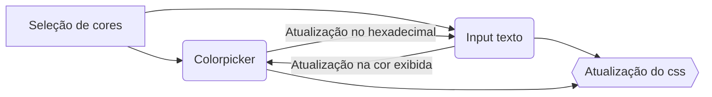

<h1>GeradorCss - EasyCss</h1>

<a href="nicolasbispo.github.io/GeradorCss/">Live preview</a>

Bem-vindo ao Gerador de CSS! Um projeto pessoal criado para facilitar a criação de estilos personalizados para o seu site. Com essa ferramenta intuitiva, você pode gerar código CSS de forma simples e rápida, sem precisar escrever manualmente.

No site, você encontrará três recursos principais para personalizar seus estilos:

1.  Gerador de Gradiente: Crie gradientes incríveis para os fundos dos seus elementos. Escolha cores, posições e ângulos para obter o efeito desejado.
    
2.  Gerador de Borda: Personalize as bordas dos seus elementos. Defina a espessura, cor e escolha quais bordas deseja aplicar. Adicione cantos arredondados para um visual mais suave.
    
3.  Gerador de Box-Shadow: Crie sombras elegantes para destacar seus elementos. Ajuste direção, desfoque, espalhamento e cor da sombra para obter o efeito desejado.
    

Experimente diferentes combinações de estilos em tempo real e veja as alterações na visualização. Uma vez satisfeito com o resultado, copie o código CSS gerado e utilize em seu projeto.

O Gerador de CSS está aqui para tornar a criação de estilos mais fácil e divertida. Explore todas as opções disponíveis e dê um toque único ao seu site. Aproveite!

## <h3>Gerador de gradiente</h3>

<h4>Funcionalidades<h4>

 - 
O gerador permite adicionar pontos de ancoragem do gradiente

 - 
Escolher a cor por meio de um colorpicker

 - 
Escolher a cor por meio hexadecimal

 - 
Escolher a posição do ponto

 - 
Alterar o tipo de gradiente (Linear e Radial)

 - 
Escolher a direção e angulação do gradiente linear

 - **Copiar o texto gerado via botão**

## Gerador de borda
Alteração de tamanho, tipo e cor da borda

Alteração curvatura da borda (border-radius)

## Gerador de box-shadow
Alteração nas propriedades do box shadow, é possivel alterar todas propriedades, é gerado o css com 3 nomes diferentes para garantir que qualquer navegador execute o código corretamente

## Funcionamento dos mecanismos

**Gradiente**

